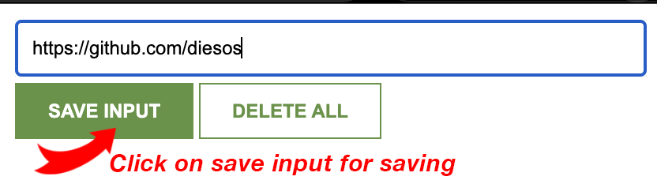
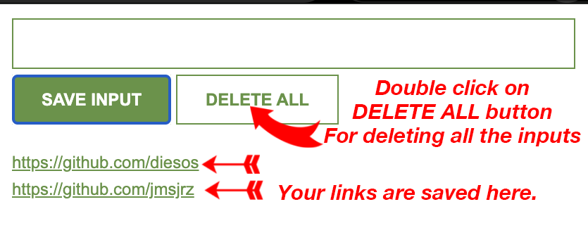

# Chrome Extension: Link Saver

## Description
The Chrome Extension "Link Saver" allows users to save links directly within the extension. It provides a convenient way to store important links and access them later without the risk of losing them. Additionally, users can quickly open the saved links in a new tab with just a click.

## Features
- Save links directly within the extension.
- Generate a "pin" for each saved link for easy reference.
- Open saved links in a new tab with a single click.
- Simple and intuitive user interface.

## Installation
To install the "Link Saver" extension:
1. Download the extension files from the GitHub repository.
2. Open Google Chrome and navigate to `chrome://extensions`.
3. Enable "Developer mode" by toggling the switch in the top right corner.
4. Click on "Load unpacked" and select the directory where you saved the extension files.

## Usage
1. Open the Chrome browser.
2. Click on the "Link Saver" extension icon in the toolbar.
3. Type or paste the link you want to save into the input field.
4. Click on the "Save" button.
5. A "pin" for the saved link will be generated and displayed in the extension.
6. To open a saved link, simply click on it in the extension popup, and it will open in a new tab.

## Screenshots

## Contributing
Contributions are welcome! If you'd like to contribute to the development of the "Link Saver" extension, please follow these steps:
1. Fork the repository.
2. Create a new branch (`git checkout -b feature/your-feature-name`).
3. Make your changes.
4. Commit your changes (`git commit -am 'Add new feature'`).
5. Push to the branch (`git push origin feature/your-feature-name`).
6. Create a new Pull Request.

## License
This project is licensed under the [MIT License](LICENSE).

## Contact
For any inquiries or feedback, please contact [Omer Ozturk](mailto:ozturk@live.fr).
